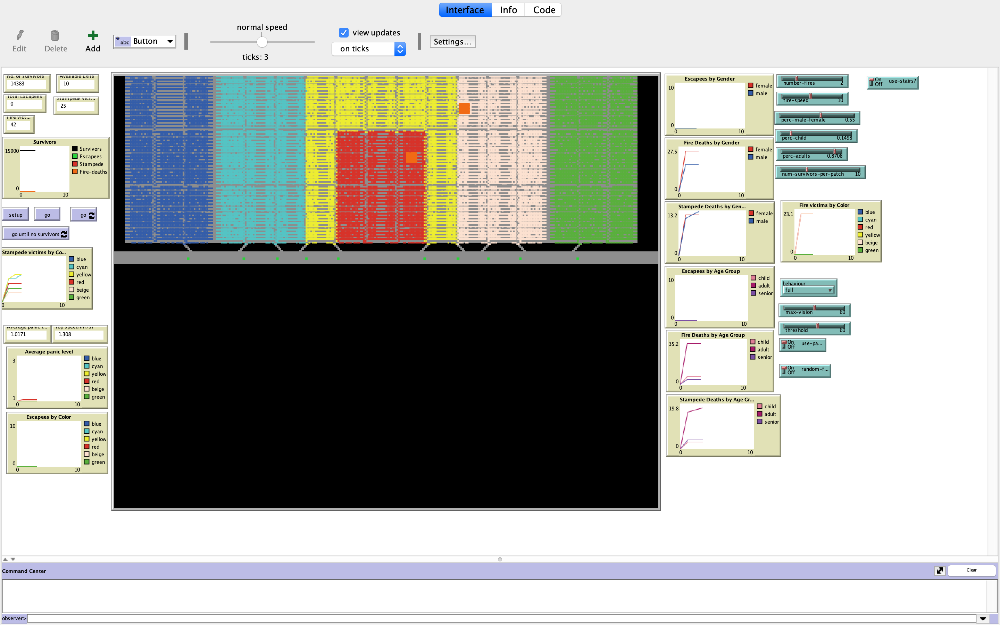

## Crowd Evacuation Simulation

## WHAT IS IT?

This model simulates the evacuation of a large crowded stadium triggered by a fire event. The user can select several strategies, define new speeds and number of exist to simulate different environments conditions.

## How to run
* Run the setup to setup the arena and all agents
* Press go to issue one step
* Press go with recurrent for continuous simulation
* Press go until no survivors for simulating until no survivors

Agent will start to move to exits and escape from spreading fire

## Parameters
* Fire speed
* Number of fires
* Panic behaviour active
* Strategy to be used (agent behaviour) 4 possible strategies
* Random fire of fixed position
* max number survivors per patch
* threshold for survivor health control
* max vision for each agent (draw from normal distribution with max limit)

## Hardcoded parameters
* Male/Female distribution
* Child/Adult/Eldery distribution
* Child speed
* Adult Speed
* Eldery speed
* Panic speeds

## Notes

Some many other parameters can be easily set, but to avoid a cluttered GUI environment
only the most important were put on user direct control.
The other can be easily defined on the script on globals

To speed things, change speed.

## Acknowledges

Based o the work of shingkid with multiple fires, followed the leader, reroute exit and new path finder algorithm

